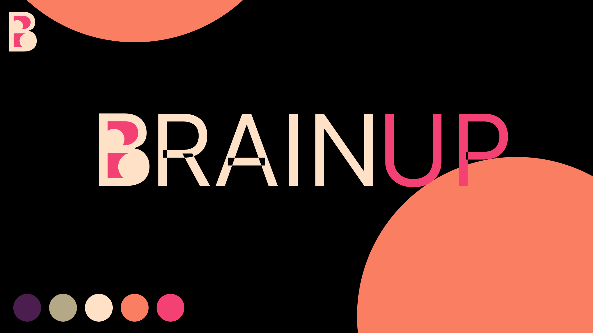

### Objetivo

Disponibilizar solução para ajudar pessoas a apreender com sigo mesmo de uma forma simples, legal e eficiente utilizando o conceito da [curva de aprendizado](https://poseducacao.unisinos.br/blog/curva-aprendizagem#:~:text=A%20curva%20de%20aprendizagem%20tem,em%20determinado%20assunto%20ou%20tarefa.) 

------------------
### Tecnologia

| Tecnologia  | Escolha |
   |---|---|
| Aplicativo | Nativo |
| Linguagem | Kotlin |
| Framework de Injeção | Dagger hilt |
| Database ORM | RomDB |
| Toolkit UI | Compose |

Esse projeto gerencia os multi-modules utilizando o [global-manager](global-manager/README.md).

> Decisões em andamento, acompanhe o progresso pelo [miro](https://miro.com/welcomeonboard/SGNKNkFBWmVnS0JkVGNETkhtZ0pVSWtPWHNBcGo5aVYxeTZnS2FRajhDM1A5OHV5S3JhNzNyTjJUTHNvdGJoRHwzMDc0NDU3MzU0NTg5MjEyMTkyfDI=?share_link_id=502824820012)

As escolhas técnicas serão documentada via ARD: Backlog

------------------

### Padrões
------------------
