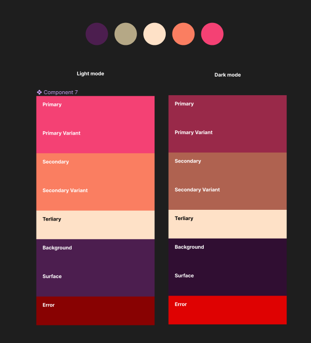
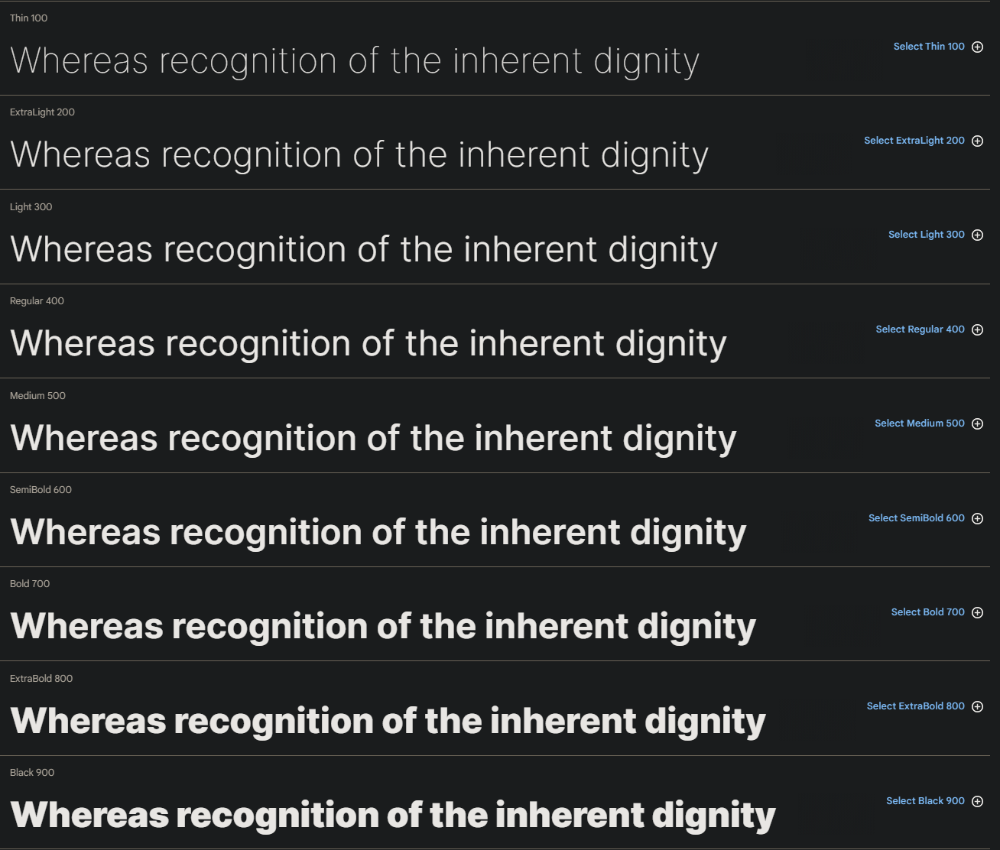
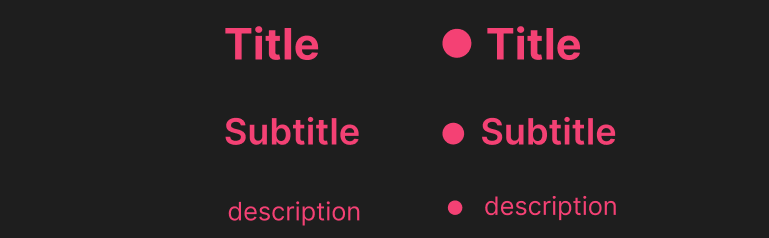

# Pet (Design system)

## Objetivo

Esse modulo é responsável por centralizar todos os componentes e configurações relacionado
ao design system, apelidado de **pet** por que está sendo planejado e criado com carinho
com a ideia de ser um visual simples, prático e fofo.

**Note:** Os componentes ainda se encontra em desenvolvimento

## Algumas especificações

### cores

As cores foram gerada utilizando o site [coolors](https://coolors.co/4c1e4f-b5a886-fee1c7-fa7e61-f44174),
onde entendemos que conseguimos um pattern ideal para o modelo do aplicativo proposto.

### Fontes

Esse projeto utiliza a fonte [Inter](https://fonts.google.com/specimen/Inter) do google fonts,
visando um design "suave".

### Text

Componente de texto inicialmente terá 3 design, **Title**,**Subtitle** e **description** 
seguindo as configurações abaixo:

| Estilo | Font | Tamanho |
   |---|---|---|
| Title | Inter bold | 24 |
| Subtitle | Inter semi bold | 20 |
| Description| Inter regular | 14 |

## Todo: Card 
## Todo: Button
## Todo: Progress
## Todo: Loading
## Todo: Toolbar
## Todo: Bottom sheet
## Todo: Card Indicator
## Todo: Card Statistics
## Todo: Setting botton
## Todo: Flip Card
